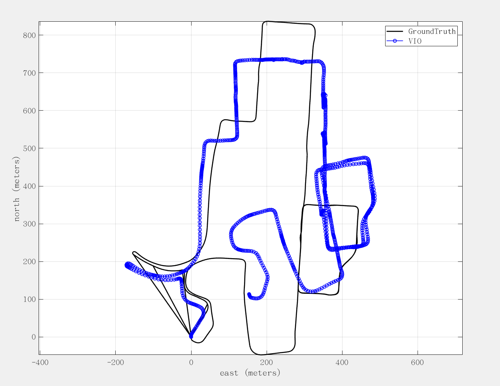
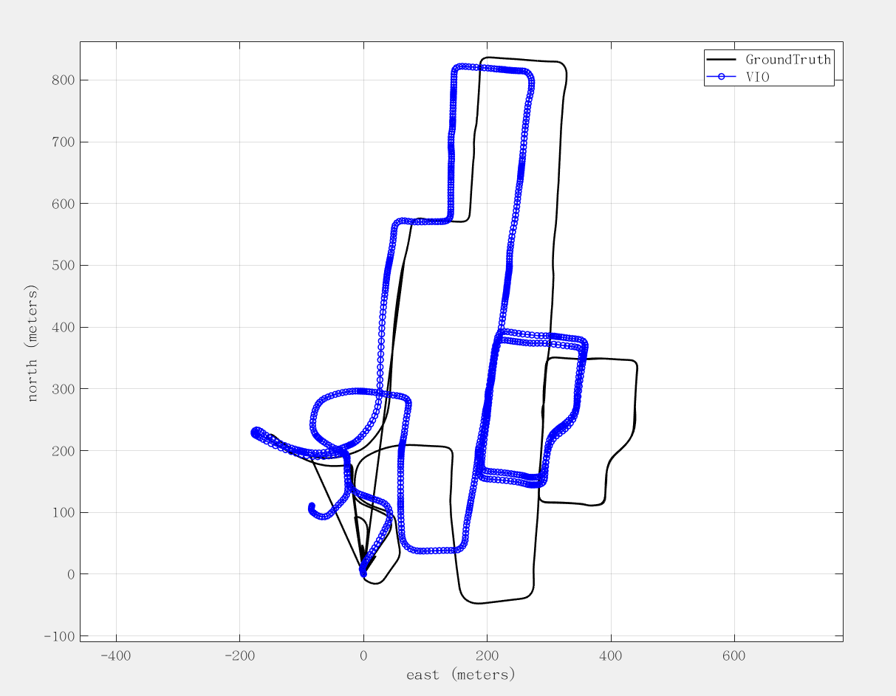
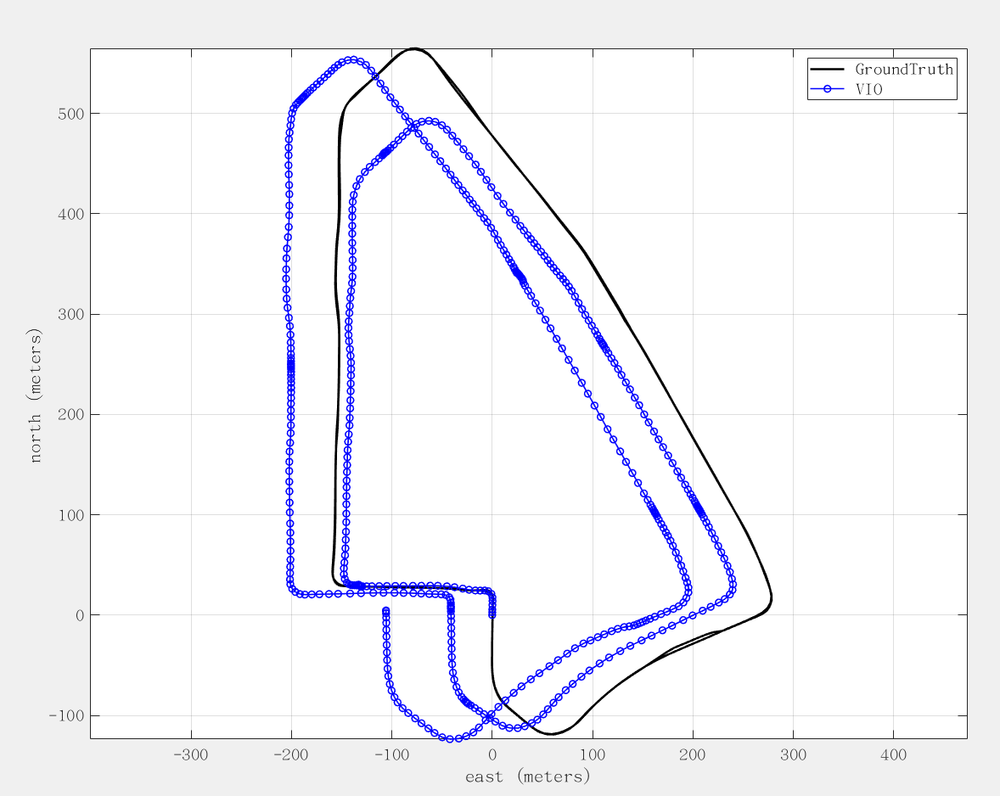
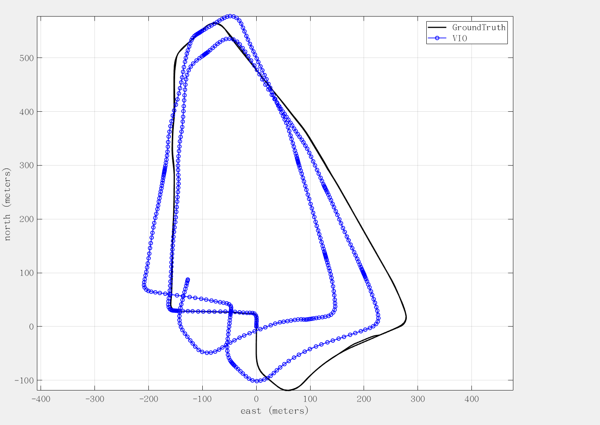

_____________________
# catkin

# Useful commandline
- evo_rpe tum groundTruth.csv vio.csv --plot --plot_mode xyz --save_plot ./VINSplot --save_results ./VINS.zip

# Evaluation results
## Day 20210508 by xiwei: the VIO and Groundtruth are successfully aligned (the whampoaData-0521 validation) 
## 1. Evaluation of Whampoa data:UrbanNav-HK-Deep-Urban-1
### 1) When Left camera is used, set estimate_extrinsic: 1 (Have an initial guess about extrinsic parameters)
### The evaluation result as follows:
       max	15.405519
      mean	0.681131
    median	0.384471
       min	0.000118
      rmse	1.142427
       sse	2004.693594
       std	0.917169
- Trajectory

  

### 2) When Stereo camera is used, set estimate_extrinsic: 1,and set td: 0.05 
### Interestingly, we play the bag file starting from second 1 (rosbag  play -s 1 Whampoasensors.bag), then the data can initialize successfully, otherwise fail. This is interesting point, there must be a reason behind that. 
### The evaluation result as follows:
       max	2.372637
      mean	0.327725
    median	0.197800
       min	0.000059
      rmse	0.505415
       sse	392.107044
       std	0.384760
- Trajectory

  

## 2. Evaluation of TST data:UrbanNav-HK-Medium-Urban-1
### 1) When Left camera is used, set estimate_extrinsic: 0 (Have an acurate extrinsic parameters)
### The evaluation result as follows:
      max	4.726060
      mean	0.734495
    median	0.401529
       min	0.000484
      rmse	1.145298
       sse	1029.691026
       std	0.878763
- Trajectory

  

### 2) Stereo camera is used, set estimate_extrinsic: 1,and set td: 0 
### The evaluation result as follows:
       max	2.909680
      mean	0.480456
    median	0.314631
       min	0.000184
      rmse	0.726379
       sse	414.187215
       std	0.544783
- Trajectory

  

## 3. Evaluation of Mongkok data:UrbanNav-HK-Harsh-Urban-1
### Fail T-T

# Acknowledgements
### The VINS-Fusion (https://github.com/HKUST-Aerial-Robotics/VINS-Fusion) framework is used for performance evaluation of dataset collected in Hong Kong urban canyons. When performing coordinate transformation，some functions are derived from GraphGNSSLib (https://github.com/weisongwen/GraphGNSSLib). We appreciate and respect the authors' efforts for their contribution to the research community. If there is any thing inappropriate, please contact me through 19078299r@connect.polyu.hk (BAI).

# Used Dataset

https://github.com/IPNL-POLYU/UrbanNavDataset

